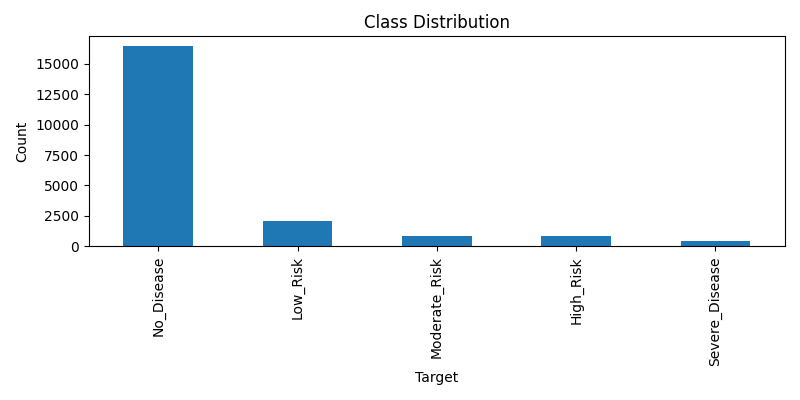
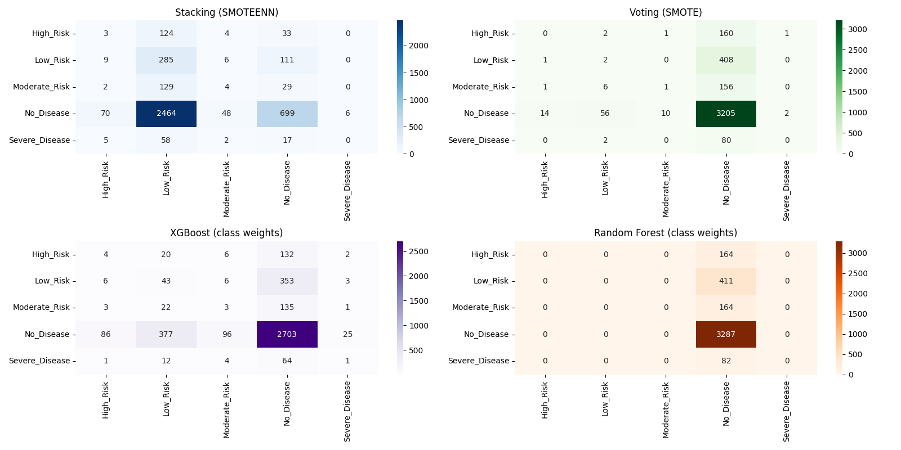
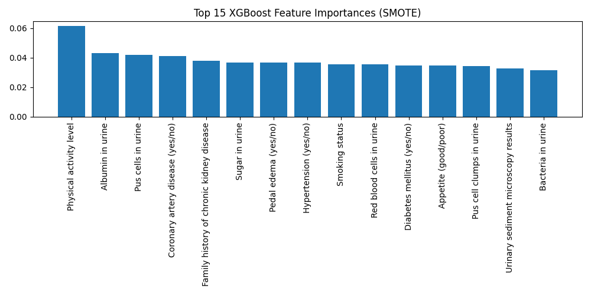
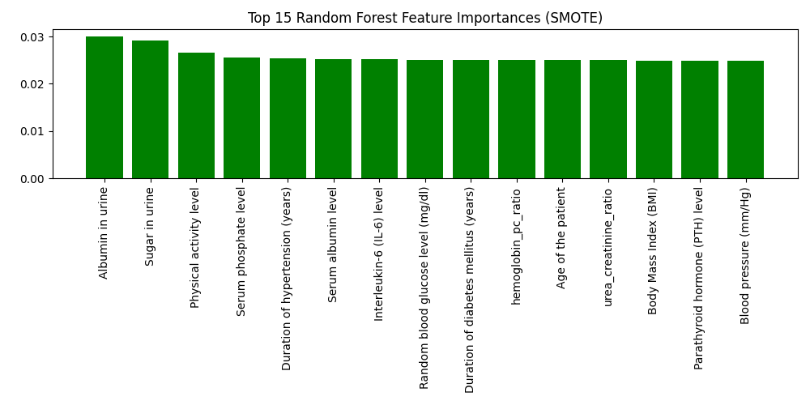

# Kidney Disease Multiclass Classification

This project tackles multiclass classification of kidney disease risk using the [Kidney Disease Dataset](https://www.kaggle.com/datasets/amanik000/kidney-disease-dataset). The main challenge is **extreme class imbalance**: the majority of cases are "No_Disease", while high-risk and severe disease classes are rare.

## Objectives
- Predict the risk class for kidney disease patients
- Address class imbalance using advanced resampling and ensemble methods
- Compare performance across different balancing and modeling strategies
- Provide interpretable results and visualizations

# Data Overview
- **Samples:** 20,538
- **Classes:** No_Disease, Low_Risk, Moderate_Risk, High_Risk, Severe_Disease
- **Imbalance:** "No_Disease" is the dominant class; others are rare

## Class Distribution


# Methodology

## 1. Feature Engineering
- **Age Group Binning:** Patients grouped into child, young adult, adult, senior
- **Medical Ratios:** e.g., blood urea/creatinine, hemoglobin/packed cell volume
- **Low-Variance & Highly Correlated Features:** Removed to reduce noise
- **Categorical Encoding:** All categorical features label-encoded

## 2. Data Balancing
- **SMOTEENN:** Hybrid oversampling and cleaning
- **SMOTE:** Pure oversampling
- **Class Weights:** Used in XGBoost and Random Forest

## 3. Models & Ensembles
- **Stacking Ensemble:** XGBoost, Random Forest, MLP (SMOTEENN balanced)
- **Voting Ensemble:** XGBoost, Random Forest, MLP (SMOTE balanced)
- **XGBoost & Random Forest:** With class weights
- **Isolation Forest:** For anomaly detection (flagging rare/atypical cases)

# Results

## Classification Reports (Test Set)

### Stacking Ensemble (SMOTEENN)

```
                precision    recall  f1-score   support

     High_Risk       0.03      0.02      0.02       164
      Low_Risk       0.09      0.69      0.16       411
 Moderate_Risk       0.06      0.02      0.04       164
    No_Disease       0.79      0.21      0.33      3287
Severe_Disease       0.00      0.00      0.00        82

      accuracy                           0.24      4108
     macro avg       0.20      0.19      0.11      4108
  weighted avg       0.64      0.24      0.29      4108
```

### Voting Ensemble (SMOTE)

```
                precision    recall  f1-score   support

     High_Risk       0.00      0.00      0.00       164
      Low_Risk       0.03      0.00      0.01       411
 Moderate_Risk       0.08      0.01      0.01       164
    No_Disease       0.80      0.98      0.88      3287
Severe_Disease       0.00      0.00      0.00        82

      accuracy                           0.78      4108
     macro avg       0.18      0.20      0.18      4108
  weighted avg       0.65      0.78      0.70      4108
```

### XGBoost (class weights)

```
                precision    recall  f1-score   support

     High_Risk       0.04      0.02      0.03       164
      Low_Risk       0.09      0.10      0.10       411
 Moderate_Risk       0.03      0.02      0.02       164
    No_Disease       0.80      0.82      0.81      3287
Severe_Disease       0.03      0.01      0.02        82

      accuracy                           0.67      4108
     macro avg       0.20      0.20      0.20      4108
  weighted avg       0.65      0.67      0.66      4108
```

### Random Forest (class weights)

```
                precision    recall  f1-score   support

     High_Risk       0.00      0.00      0.00       164
      Low_Risk       0.00      0.00      0.00       411
 Moderate_Risk       0.00      0.00      0.00       164
    No_Disease       0.80      1.00      0.89      3287
Severe_Disease       0.00      0.00      0.00        82

      accuracy                           0.80      4108
     macro avg       0.16      0.20      0.18      4108
  weighted avg       0.64      0.80      0.71      4108
```

## Anomaly Detection
- **Isolation Forest** flagged 212 out of 4108 test samples as anomalies (potential rare or atypical cases).

## Visualizations

### All Confusion Matrices


### Top 15 Feature Importances (XGBoost)


### Top 15 Feature Importances (Random Forest)


# Conclusions

- **Extreme class imbalance** is a major challenge; no method perfectly predicts minority classes.
- **SMOTEENN stacking** improves recall for some minority classes at the cost of overall accuracy.
- **Voting/class-weighted models** have high accuracy but mostly predict the majority class.
- **Anomaly detection** is useful for flagging rare/atypical cases.
- **Feature importance plots** help interpret what drives model decisions.

## Final Macro F1 Scores
- **Stacking (SMOTEENN):** 0.11
- **Voting (SMOTE):** 0.18
- **XGBoost (class weights):** 0.20
- **Random Forest (class weights):** 0.18

# Recommendations
- For research, use stacking/SMOTEENN to maximize minority class recall.
- For deployment, use class-weighted or voting models for overall accuracy.
- For rare case flagging, use anomaly detection.
- More data for rare classes or domain-specific features would further improve results.

---

*This project demonstrates the complexity of multiclass prediction under extreme imbalance and provides a robust, reproducible pipeline for future research and improvement.*
